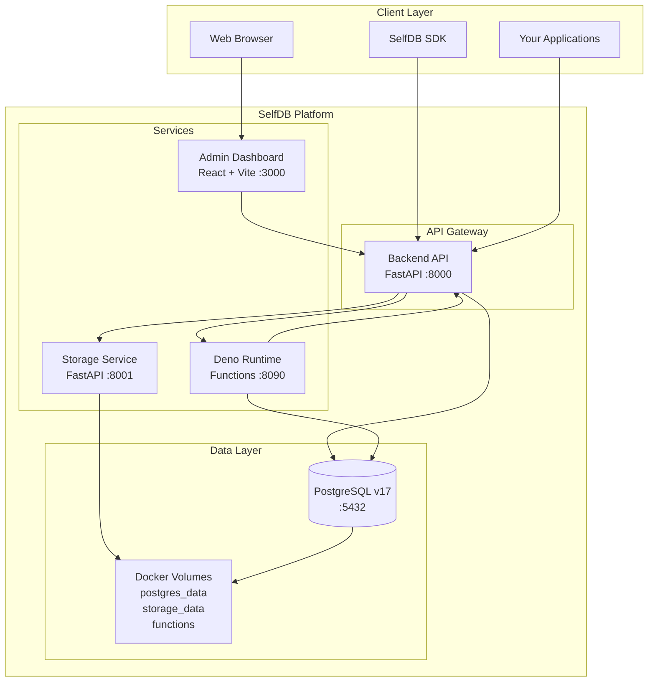

# SelfDB

SelfDB is a powerful, self-hosted, open-source alternative to Supabase that provides a complete backend platform for modern applications. Built with Python (FastAPI), React, and Deno, it combines PostgreSQL database, authentication, object storage, real-time capabilities, and serverless functions in a single, containerized solution with no vendor lock-in.

## 🚀 Key Features

### Core Infrastructure
- **PostgreSQL Database (v17)**: Full-featured PostgreSQL with migrations, triggers, and advanced SQL capabilities
- **Authentication & Authorization**: JWT-based auth with refresh tokens, user management, and anonymous API key access
- **Custom Object Storage**: Built-in storage service for file/bucket management (no external S3 required)
- **Real-time Engine**: WebSocket-powered real-time subscriptions for database changes and events
- **Serverless Functions**: Deno 2.0 runtime for TypeScript/JavaScript cloud functions with multiple trigger types
- **Admin Dashboard**: Full-featured React UI for database management, SQL editing, and platform administration

### Developer Experience
- **Docker Compose Deployment**: Single command to run the entire platform
- **RESTful API**: FastAPI-powered API with automatic OpenAPI/Swagger documentation
- **SQL Editor**: Built-in SQL editor with syntax highlighting and schema visualization
- **Hot Reload**: Development mode with automatic reloading for all services
- **Version Control**: Function versioning with history tracking
- **Anonymous Access**: Built-in support for public APIs via API keys

### Production Features
- **Security**: HTTPS/SSL support, secure password hashing, CORS configuration
- **Monitoring**: Activity tracking, logging, and real-time activity feeds
- **Data Persistence**: Docker volumes for reliable data storage
- **Backup & Restore**: Built-in backup strategies for databases and files
- **CI/CD Ready**: Includes Gitea workflows for automated deployments
- **Open Source**: MIT licensed - free to use, modify, and distribute


## Prerequisites

- Docker and Docker Compose
- Git (for cloning the repository)
- SSL certificate and domain for production deployments

## Quick Start

1. Clone the repository:
   ```bash
   git clone https://github.com/Selfdb-io/SelfDB
   cd SelfDB
   ```

2. Create a `.env` file from the example:
   ```bash
   cp .env.example .env
   ```

3. Edit the `.env` file to set secure passwords and configuration.

4. Start the application using the provided script (which sets up Docker volumes for data persistence):
   ```bash
   ./start.sh
   ```

   **Note:** The application uses Docker named volumes for data persistence. These volumes are managed by Docker and will persist even when containers are removed.

   Alternatively, you can start the services directly with Docker Compose:
   ```bash
   docker-compose up -d
   ```

5. The database will be automatically initialized on first startup with:
   - Database tables created via migrations
   - Default superuser created with the credentials specified in your `.env` file:
     - Email: `DEFAULT_ADMIN_EMAIL` (default: `admin@example.com`)
     - Password: `DEFAULT_ADMIN_PASSWORD` (default: `adminpassword`)
   - Anonymous API key (`ANON_KEY`) generated for public access to resources

   **Important:** Change these credentials in your `.env` file for production use!

   If you need to manually run the initialization later:
   ```bash
   docker-compose exec backend python -m app.initial_data
   ```

6. Access the application:
   - Frontend: http://localhost:3000
   - API: http://localhost:8000
   - Storage Service: http://localhost:8001
   - Deno Runtime: http://localhost:8090 (internal service for cloud functions)

## 🏗️ Architecture

SelfDB uses a modern microservices architecture with all components containerized:



### Component Details

- **Backend API (FastAPI)**: Core API server handling authentication, database operations, real-time subscriptions, and coordination between services
- **Admin Dashboard (React)**: Full-featured UI for database management, SQL editing, user management, and function development
- **Storage Service**: Custom-built object storage service for file and bucket management with streaming support
- **Deno Runtime**: Isolated environment for executing serverless functions with TypeScript/JavaScript support
- **PostgreSQL Database**: Primary data store with support for advanced features like triggers, LISTEN/NOTIFY, and migrations

## Anonymous Access

SelfDB supports anonymous access to public resources using an API key. This allows unauthenticated clients to access designated public resources without requiring user login.

### How it works

1. A unique `ANON_KEY` is automatically generated during setup and stored in the `.env` file.
2. Clients include this key in the `apikey` HTTP header of their requests.
3. Endpoints check if the request is authenticated (JWT token), anonymous (valid `ANON_KEY`), or unauthorized.
4. Resources (like buckets and files) have an `is_public` flag that controls whether they can be accessed anonymously.

#### Backend Implementation

The SelfDB backend implements anonymous access through a dedicated authentication dependency:

- An `APIKeyHeader` scheme extracts the key from the `apikey` HTTP header
- The `get_current_user_or_anon` dependency function checks for both JWT tokens and the anon key
- When a valid anon key is provided, it returns a special `ANON_USER_ROLE` constant
- API endpoints can distinguish between authenticated users, anonymous users, and unauthorized requests
- This allows for fine-grained access control based on authentication status


### Security Considerations

- The `ANON_KEY` provides read and write access to public resources.
- Only mark resources as public if you intend them to be accessible without authentication.
- For production use, consider regenerating the `ANON_KEY` periodically.
- Anonymous users can typically:
  - Read data from public tables
  - Write data to public tables (with appropriate permissions)
  - List public buckets
  - Upload files to public buckets
  - View files from public buckets
- Anonymous users cannot typically:
  - Access private resources
  - Modify or delete resources created by authenticated users
  - Access administrative endpoints

### Sample Application

  1. https://github.com/Selfdb-io/selfdb-expo-app
  2. https://github.com/Selfdb-io/selfdb-swift-app
  3. https://github.com/Selfdb-io/selfdb-react-vite

**Note for Production Use:**
When deploying the sample app to production, modify the `.env` file to use your SSL-secured API URL:
```
VITE_API_URL=https://api.your-domain.com/api/v1
VITE_ANON_KEY=your_anon_key
```

## Development

### Rebuilding Containers

During development, you may need to rebuild your containers without losing your data. Use the provided rebuild script:

```bash
./rebuild.sh
```

This script will rebuild all containers while preserving your data stored in Docker volumes.

### Backend

The backend is built with FastAPI and provides:

- REST API endpoints for authentication, file management, etc.
- WebSocket connections for real-time updates
- Database models and migrations
- Integration with the Storage Service for object storage
- Cloud function management and deployment
- Code validation and linting services for the function editor

To run the backend in development mode:

```bash
cd backend
pip install -r requirements.txt
uvicorn app.main:app --reload
```

### Frontend

The frontend is built with React and provides:

- User interface for authentication, file management, etc.
- Integration with the backend API
- Real-time updates using WebSockets
- Cloud function management interface

To run the frontend in development mode:

```bash
cd frontend
npm install
npm start
```

### SDK

SelfDB provides python, Javascript and swift SDKS:
1. https://github.com/Selfdb-io/js-sdk
2. https://github.com/Selfdb-io/selfdb-ios
3. https://github.com/Selfdb-io/selfdb-py


### Cloud Functions

SelfDB's serverless functions platform powered by Deno 2.0 enables you to run custom business logic without managing servers:

#### Function Types

1. **HTTP Functions**: REST API endpoints that respond to HTTP requests
2. **Database Triggers**: React to INSERT, UPDATE, or DELETE operations on tables
3. **Scheduled Functions**: Run on a cron schedule for periodic tasks
4. **Event Functions**: Respond to custom events from your application
5. **Setup Functions**: One-time initialization functions for data setup

#### Features

- **TypeScript/JavaScript Support**: Write functions in modern JS/TS with full Deno API access
- **Environment Variables**: Secure configuration and secrets management
- **Direct Database Access**: Query your PostgreSQL database from functions
- **Version Control**: Automatic versioning with rollback capabilities
- **Hot Reload**: Instant updates in development mode
- **Validation & Linting**: Built-in code quality checks


## Production Deployment

For production deployment, consider the following:

1. Use strong, unique passwords in the `.env` file
2. Set up a reverse proxy (like Nginx) with SSL/TLS
3. Configure proper backup strategies for the data directories
4. Set up monitoring and logging

### Production URL Configuration

When deploying to production, you must configure secure URLs with SSL for both the admin interface and API access:

1. **Frontend Admin URL**:
   - The frontend should be accessed through a secure domain with SSL
   - Update your reverse proxy (Nginx, etc.) to point to your SelfDB frontend container
 

2. **Backend API URL**:
   - The API should also be accessed through a secure domain with SSL
   - Update the same or a different reverse proxy to point to your SelfDB backend container
  
3. **Sample Apps Configuration**:
   - For any sample or production apps built using SelfDB, update the API URL in their environment files:
   - Example `.env` file for a React/Vite app:
     ```
     VITE_API_URL=https://api.yourdomain.com/api/v1
     VITE_ANON_KEY=your_anon_key
     ```

**Summary of Production URL Configuration:**
- Admin UI access requires a secure domain (HTTPS) with SSL certificates
- API access requires a secure domain with proper WebSocket support
- All WebSocket connections must use WSS (WebSocket Secure) in production
- All sample apps must be configured with HTTPS URLs pointing to your secured API
- The configuration includes specific Nginx location blocks for different connection types:
  - Standard HTTP/HTTPS requests (`/`)
  - WebSocket connections for real-time features (`/ws/`)
  - Dedicated realtime connections (`/realtime/`)

**Important**: Always use HTTPS URLs in production to ensure security for your data and authentication tokens.

## Backup and Restore

To backup your data:

1. Stop the containers:
   ```bash
   docker-compose down
   ```
  

2. Backup the Docker volumes:
   ```bash
   # For PostgreSQL data
   docker run --rm -v postgres_data:/data -v $(pwd):/backup alpine tar -czf /backup/postgres-backup.tar.gz /data

   # For Storage Service data
   docker run --rm -v storage_data:/data -v $(pwd):/backup alpine tar -czf /backup/storage-backup.tar.gz /data
   ```

To restore from a backup:

1. Stop the containers:
   ```bash
   docker-compose down
   ```

2. Remove existing volumes (if any):
   ```bash
   docker volume rm postgres_data storage_data || true
   ```

3. Create empty volumes:
   ```bash
   docker volume create postgres_data
   docker volume create storage_data
   ```

4. Restore from backup:
   ```bash
   # For PostgreSQL data
   docker run --rm -v postgres_data:/data -v $(pwd):/backup alpine tar -xzf /backup/postgres-backup.tar.gz -C /

   # For Storage Service data
   docker run --rm -v storage_data:/data -v $(pwd):/backup alpine tar -xzf /backup/storage-backup.tar.gz -C /
   ```

5. Start the containers:
   ```bash
   docker-compose up -d
   ```

## 🎯 Use Cases

SelfDB is perfect for:

- **SaaS Applications**: Multi-tenant apps with user authentication and file storage
- **Mobile App Backends**: Real-time sync and offline-first applications
- **Web Applications**: Full-stack apps with database, auth, and file handling
- **API Services**: RESTful APIs with built-in documentation and authentication
- **Internal Tools**: Company dashboards and admin panels with secure access
- **IoT Platforms**: Real-time data ingestion and event processing
- **Content Management**: File storage and management with public/private access
- **Analytics Dashboards**: Real-time data visualization with WebSocket updates

## 🤝 Contributing

We welcome contributions! Please see our contributing guidelines and code of conduct.

## 📜 License

SelfDB is open source software licensed under the MIT License. See [LICENSE.md](LICENSE.md) for details.


## 🙏 Acknowledgments

SelfDB is inspired by Supabase and Firebase. 
We aim to provide a truly self-hosted alternative with no compromises on features or developer experience.

---

Built with ❤️ by the SelfDB community.
