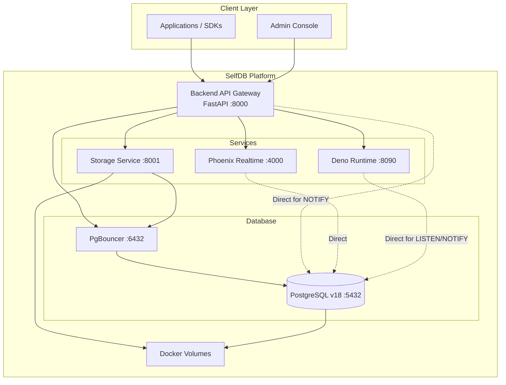

# SelfDB v0.05 · early beta [](https://deepwiki.com/Selfdb-io/SelfDB)


> ⚠️ **Early beta:** This stack is shared for user testing and feedback. Expect sharp edges, manual setup, and breaking changes while the team collects real-world input for the production milestone.

SelfDB is an open-source, self-hosted backend-as-a-service platform that provides a complete, production-ready stack for building modern applications. Built with PostgreSQL at its core, SelfDB delivers database management, file storage, realtime events, serverless functions, webhooks, and an intuitive admin dashboard—all orchestrated through Docker Compose.

The 2025 rebuild delivered:
- Unified REST API gateway with comprehensive endpoint coverage
- Flexible multi-environment deployment with isolated port configurations  
- Role-based access control (RBAC) with JWT authentication
- Phoenix realtime WebSocket relay with PG NOTIFY integration
- Deno-based serverless function runtime with multiple trigger types
- Production-grade connection pooling via PgBouncer
- Comprehensive test suite achieving 90%+ code coverage

## Platform architecture

SelfDB consists of six containerized services:

**Backend API (FastAPI)** – Unified gateway serving all REST endpoints
- Authentication & user management (JWT + refresh tokens)
- Dynamic table operations with schema introspection
- SQL execution with parameterized query support
- Bucket & file management with streaming proxies
- Serverless function deployment & execution
- Webhook management with delivery tracking
- WebSocket proxy for realtime connections (`/api/v1/realtime/ws`)
- PG NOTIFY listener forwarding database events to Phoenix

**Storage Service (FastAPI)** – Internal file storage engine
- S3-compatible blob storage API with multipart upload support
- HTTP range request handling for streaming media
- Direct filesystem persistence to Docker volumes

**Deno Runtime (Deno 2.2.11)** – Serverless function execution engine
- TypeScript/JavaScript function execution
- Multiple trigger types: HTTP, scheduled (cron), database (LISTEN/NOTIFY), events, webhooks
- Direct PostgreSQL connection for LISTEN/NOTIFY (bypasses PgBouncer)
- Hot-reload on file changes

**Phoenix Realtime (Elixir/OTP)** – WebSocket relay service
- Channel-based pub/sub messaging
- HTTP broadcast API for database events
- Internal-only service (no exposed ports)
- Accessed via Backend WebSocket proxy at `/api/v1/realtime/ws`

**PostgreSQL 18 + PgBouncer** – Database layer
- PostgreSQL 18 with latest performance optimizations
- PgBouncer connection pooling (session mode)
- Automatic schema initialization and migration system
- NOTIFY triggers for realtime events

**Frontend Admin Console (React + Vite + Nginx)** – Web-based control panel
- Dashboard with system metrics & activity feed
- SQL editor with syntax highlighting
- Visual table designer
- File browser with drag-and-drop uploads
- Function editor with live deployment

## Service topology



**Note:** PgBouncer doesn't support PostgreSQL LISTEN/NOTIFY, so services needing this feature connect directly to PostgreSQL on port 5432.

## Requirements

### Host system
- **Docker Engine 20.10+** with Docker Compose V2 (must be running)
- **Node.js 20+** (for frontend build stage in Docker)
- **Python 3.13+** with [`uv`](https://github.com/astral-sh/uv) package manager (for running tests and scripts)
- **Operating system:** Linux, macOS, or Windows (with WSL2 recommended)

### System resources (minimum)
- **CPU:** 4 cores
- **RAM:** 8 GB
- **Disk:** 20 GB available space
- **Network:** Ports available for service binding (see environment configuration)

## Environment configuration

SelfDB uses environment files (`.env.*`) to configure all service ports, credentials, and feature flags. The platform supports multiple isolated environments running simultaneously on the same host.

### Environment files

Create one or more environment files:
- `.env.dev` – Development (local testing)
- `.env.staging` – Staging (pre-production)
- `.env.prod` – Production (live deployment)

### Environment template

```ini
# PROJECT IDENTIFICATION
COMPOSE_PROJECT_NAME=selfdb_dev
INSTANCE_ID=development
ENV=dev

# NETWORK CONFIGURATION
DOCKER_NETWORK=selfdb_dev_network
DOCKER_ENV=true
DEBUG=true

# INTERNAL SERVICE PORTS (Used inside Docker network)
INTERNAL_POSTGRES_PORT=5432
INTERNAL_PGBOUNCER_PORT=6432

# EXTERNAL SERVICE PORTS (Exposed to host machine)
POSTGRES_PORT=5432
PGBOUNCER_PORT=6432
STORAGE_PORT=8001
API_PORT=8000
FRONTEND_PORT=3000
DENO_PORT=8090

# DATABASE CONFIGURATION
POSTGRES_DB=selfdb_dev
POSTGRES_USER=selfdb_dev_user
POSTGRES_PASSWORD=dev_password_123
POSTGRES_HOST=localhost

# PgBouncer connection pooling settings
PGBOUNCER_HOST=localhost
PGBOUNCER_POOL_MODE=session
PGBOUNCER_MAX_CLIENT_CONN=1000
PGBOUNCER_DEFAULT_POOL_SIZE=25

# AUTHENTICATION & SECURITY
API_KEY=dev_api_key_not_for_production
JWT_SECRET_KEY=dev_jwt_secret_not_for_production
JWT_ALGORITHM=HS256
JWT_EXPIRATION_HOURS=72
INTERNAL_API_KEY=dev_internal_api_key_for_service_communication

# ADMIN USER BOOTSTRAP
ADMIN_EMAIL=admin@example.com
ADMIN_PASSWORD=adminpassword123
ADMIN_FIRST_NAME=Admin
ADMIN_LAST_NAME=User

# CORS CONFIGURATION
ALLOWED_CORS=http://localhost:3000,http://localhost:5173,http://localhost:8000

# PHOENIX REALTIME SERVICE
PHOENIX_ENABLED=true
PHOENIX_SECRET_KEY_BASE=dev_phoenix_secret_key_base_minimum_64_characters_required_here_for_development_only

# LOGGING & MONITORING
LOG_LEVEL=DEBUG
ENABLE_METRICS=true
RELOAD=true
```

### Port allocation strategy

SelfDB uses configurable port mappings to allow multiple environments on one host:

| Service | Dev | Staging | Prod |
|---------|-----|---------|------|
| Frontend | 3000 | 3001 | 3002 |
| Backend API | 8000 | 8010 | 8020 |
| Storage | 8001 | 8011 | 8021 |
| Deno Runtime | 8090 | 8091 | 8092 |
| PostgreSQL | 5432 | 5433 | 5434 |
| PgBouncer | 6432 | 6433 | 6434 |

**Note:** Phoenix realtime service runs internally without exposed ports—clients connect via the Backend API WebSocket proxy at `/api/v1/realtime/ws`.

### Security considerations

**Production environment:**
- Generate strong random values for all secrets:
  ```bash
  openssl rand -hex 32  # API_KEY, JWT_SECRET_KEY
  openssl rand -hex 64  # PHOENIX_SECRET_KEY_BASE
  ```
- Set `DEBUG=false`
- Restrict CORS to your application domains only
- Enable HTTPS via reverse proxy (Nginx/Caddy/Traefik)
- Change admin credentials after first login

## Running the stack

SelfDB provides a unified orchestration script (`selfdb.sh`) for managing multi-environment deployments.

### Quick start (development)

```bash
# Start development stack
./selfdb.sh quick
```

After startup, access the admin console at **http://localhost:3000** (or your configured `FRONTEND_PORT`). Login with the admin credentials from your `.env.dev` file.

### Management commands

```bash
# Start specific environment
./selfdb.sh up dev          # Development
./selfdb.sh up staging      # Staging  
./selfdb.sh up prod         # Production

# Stop environment(s)
./selfdb.sh down dev        # Stop dev only
./selfdb.sh down            # Stop all

# View container status
./selfdb.sh ps dev          # Specific environment
./selfdb.sh ps              # All environments

# Stream logs
./selfdb.sh logs dev        # Follow logs for dev environment

# Clean up (removes containers AND volumes - data loss!)
./selfdb.sh clean
```

### Service URLs (development defaults)

| Service | URL | Purpose |
|---------|-----|---------|
| Admin Console | http://localhost:3000 | Web dashboard |
| Backend API | http://localhost:8000 | REST API gateway |
| API Documentation | http://localhost:8000/docs | Interactive OpenAPI docs |
| Backend Health | http://localhost:8000/health | Service health status |
| Storage Health | http://localhost:8001/health | Storage service health |
| Deno Runtime Health | http://localhost:8090/health | Function runtime health |
| PostgreSQL | localhost:5432 | Direct database access |
| PgBouncer | localhost:6432 | Pooled connections |

### Initial login

1. Navigate to http://localhost:3000
2. Login with admin credentials from `.env.dev`:
   - Email: `admin@example.com`
   - Password: `adminpassword123`

## Testing

SelfDB includes a comprehensive test suite with 90%+ code coverage.

### Setup

Before running tests, set up the Python virtual environment:

```bash
uv venv
uv install -r requirements.txt
```

### Running tests

```bash
# Install dependencies and run all tests
./run_tests.sh

# Run only unit tests (fast, no Docker required)
./run_tests.sh tests/unit

# Run only integration tests (requires Docker stack running)
./run_tests.sh integration

# Generate HTML coverage report
./run_tests.sh coverage
```

### Prerequisites for integration tests

Integration tests require the SelfDB stack to be running:

```bash
# Terminal 1: Start the stack
./selfdb.sh up dev

# Terminal 2: Run integration tests
./run_tests.sh integration
```

## API overview

SelfDB exposes a unified REST API at `/api/v1/*` with comprehensive endpoint coverage.

### Using the REST API

**Note:** Client SDKs (Swift, JavaScript, Python) are currently on v0.04 and not yet compatible with SelfDB v0.05. For testing and integrating with client applications, use the REST API directly:

- **Interactive API documentation:** Access the full REST API documentation via the admin console at http://localhost:3000 → "API Reference" tab (also available at http://localhost:8000/docs)
- **API endpoints:** All endpoints are accessible at `http://localhost:8000/api/v1/*` (or your configured `API_PORT`)
- **Authentication:** Use JWT tokens obtained via `/api/v1/auth/login` endpoint
- **Testing:** Use the admin dashboard's built-in API reference viewer to explore endpoints, view request/response schemas, and generate example cURL commands

### Authentication endpoints

| Endpoint | Method | Purpose | Auth |
|----------|--------|---------|------|
| `/api/v1/auth/register` | POST | Create new user account | API key |
| `/api/v1/auth/login` | POST | Login with email/password | API key |
| `/api/v1/auth/refresh` | POST | Refresh access token | Refresh token |
| `/api/v1/auth/me` | GET | Get current user profile | JWT |
| `/api/v1/auth/logout` | POST | Logout (invalidate tokens) | JWT |

### User management (Admin only)

| Endpoint | Method | Purpose | Auth |
|----------|--------|---------|------|
| `/api/v1/admin/users` | GET | List all users | Admin JWT |
| `/api/v1/admin/users/{id}` | GET/PUT/DELETE | Get/Update/Delete user | Admin JWT |

### Table operations

| Endpoint | Method | Purpose | Auth |
|----------|--------|---------|------|
| `/api/v1/tables` | GET/POST | List/Create tables | JWT |
| `/api/v1/tables/{name}` | GET/DELETE | Get schema/Drop table | JWT |
| `/api/v1/tables/{name}/rows` | GET/POST | Query/Insert rows | JWT |
| `/api/v1/tables/{name}/rows/{id}` | GET/PUT/DELETE | Get/Update/Delete row | JWT |

### SQL execution

| Endpoint | Method | Purpose | Auth |
|----------|--------|---------|------|
| `/api/v1/sql/execute` | POST | Execute SQL query | JWT |
| `/api/v1/sql/snippets` | GET/POST | List/Save snippets | JWT |
| `/api/v1/sql/snippets/{id}` | DELETE | Delete snippet | JWT |

### Storage buckets

| Endpoint | Method | Purpose | Auth |
|----------|--------|---------|------|
| `/api/v1/buckets` | GET/POST | List/Create buckets | JWT |
| `/api/v1/buckets/{name}` | GET/PUT/DELETE | Get/Update/Delete bucket | JWT |
| `/api/v1/buckets/{name}/files` | GET | List files in bucket | JWT |

### File operations

| Endpoint | Method | Purpose | Auth |
|----------|--------|---------|------|
| `/api/v1/files/upload` | POST | Upload file | JWT |
| `/api/v1/files/{bucket}/{path}` | GET/HEAD/DELETE | Download/Metadata/Delete file | JWT |

**Video storage best practices:**
When storing videos, upload both the video file and a thumbnail image:
- **Thumbnails** are more efficient to retrieve and load faster for previews, listings, and UI components
- **Videos** can be streamed on-demand using HTTP range requests when users actually play the video
- Store thumbnail references in your database tables alongside video metadata for efficient querying
- Use thumbnails for grid views, search results, and preview cards; load full videos only when needed

### Serverless functions

| Endpoint | Method | Purpose | Auth |
|----------|--------|---------|------|
| `/api/v1/functions` | GET/POST | List/Create functions | JWT |
| `/api/v1/functions/{id}` | GET/PUT/DELETE | Get/Update/Delete function | JWT |
| `/api/v1/functions/{id}/deploy` | POST | Deploy function | JWT |
| `/api/v1/functions/{id}/execute` | POST | Execute function | JWT |
| `/api/v1/functions/{id}/executions` | GET | List executions | JWT |
| `/api/v1/functions/{id}/logs` | GET | Get function logs | JWT |

### Webhooks

| Endpoint | Method | Purpose | Auth |
|----------|--------|---------|------|
| `/api/v1/webhooks` | GET/POST | List/Create webhooks | JWT |
| `/api/v1/webhooks/{id}` | GET/PUT/DELETE | Get/Update/Delete webhook | JWT |
| `/api/v1/webhooks/{id}/deliveries` | GET | List deliveries | JWT |
| `/api/v1/webhooks/{id}` | POST | Trigger webhook (external) | API key or signature |

### Realtime WebSocket

| Endpoint | Method | Purpose | Auth |
|----------|--------|---------|------|
| `/api/v1/realtime/ws` | WS | WebSocket connection | JWT (query param) |
| `/api/v1/realtime/status` | GET | Realtime service status | JWT |

## Developer tooling

### API documentation generator

```bash
# Ensure stack is running
./selfdb.sh quick

# Generate API reference markdown
uv run python scripts/generate_api_reference.py
```

Updates `frontend/src/modules/core/constants/apiReferenceMarkdown.ts` with live API documentation.

### Storage performance benchmark

Before running the benchmark, add media files to `storage-test-files/` directory. All MIME types are supported.

```bash
# Basic usage (uses http://localhost:3000 by default)
./storage_benchmark.sh

# Custom API URL
API_URL=http://localhost:8000 ./storage_benchmark.sh
```

## Beta feedback & support

SelfDB v0.05 early beta is open for testing and feedback. We're actively improving the platform based on real-world usage.

### What we're looking for

- **Deployment experiences:** Multi-environment setup, port configuration, Docker Compose compatibility
- **Feature requests:** Missing API endpoints, SDK requirements, admin console improvements
- **Bug reports:** Authentication edge cases, storage failures, realtime issues, performance bottlenecks
- **Documentation needs:** Unclear setup instructions, missing usage examples, API reference gaps

### How to contribute

1. **File an issue** on GitHub with detailed reproduction steps
2. **Submit a pull request** with fixes or enhancements
3. **Join discussions** about architecture and feature priorities
4. **Share your use case** to help prioritize development

## License

SelfDB is released under the [MIT License](LICENSE.md). See LICENSE.md for full details.

---

**Built with:** FastAPI • PostgreSQL 18 • Phoenix/Elixir • Deno • React • Docker

**Version:** v0.05 early beta (2025 rebuild)

For the latest updates, see `CHANGELOG.md`.
